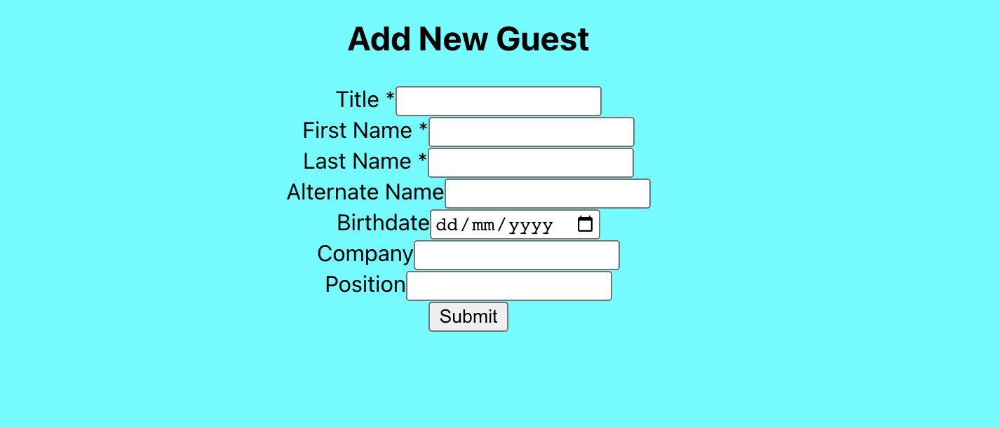

# myGuests
<!-- Improved compatibility of back to top link: See: https://github.com/othneildrew/Best-README-Template/pull/73 -->

<a name="readme-top"></a>

<!--
*** Thanks for checking out the Best-README-Template. If you have a suggestion
*** that would make this better, please fork the repo and create a pull request
*** or simply open an issue with the tag "enhancement".
*** Don't forget to give the project a star!
*** Thanks again! Now go create something AMAZING! :D
-->

<!-- PROJECT SHIELDS -->
<!--
*** I'm using markdown "reference style" links for readability.
*** Reference links are enclosed in brackets [ ] instead of parentheses ( ).
*** See the bottom of this document for the declaration of the reference variables
*** for contributors-url, forks-url, etc. This is an optional, concise syntax you may use.
*** https://www.markdownguide.org/basic-syntax/#reference-style-links
-->

<!-- PROJECT LOGO -->
<br />
<div align="center">
  <a href="https://github.com/othneildrew/Best-README-Template">
    
  </a>

  <h3 align="center">myGuests</h3>

  <p align="center">
    Make guest recognition simple and easy and spend more time engaging with your guests
    <br />
    <br />
    <a href="https://github.com/Hiro-Kanetake/myguests/graphs/contributors">Report Bug</a>
    ·
    <a href="https://github.com/Hiro-Kanetake/myguests/graphs/contributors">Request Feature</a>
  </p>
</div>

<!-- TABLE OF CONTENTS -->
<details>
  <summary>Table of Contents</summary>
  <ol>
    <li>
      <a href="#about-the-project">About The Project</a>
      <ul>
        <li><a href="#built-with">Built With</a></li>
      </ul>
    </li>
    <li>
      <a href="#getting-started">Getting Started</a>
      <ul>
        <li><a href="#prerequisites">Prerequisites</a></li>
        <li><a href="#installation">Installation</a></li>
      </ul>
    </li>
    <li><a href="#contact">Contact</a></li>
    <li><a href="#acknowledgments">Acknowledgments</a></li>
  </ol>
</details>

<!-- ABOUT THE PROJECT -->

## About The Project

Hotel staffs are usually very good with memory. They remember what their regular guests' preferences and try to make the stay experience as smooth and enjoyable as possible. However, what if you just started to work in a new hotel? What if it's the first time meeting a regular guest and you don't know their preference?

myGuests app will be the solution to hoteliers as it will keep record of your guests and you are able to check your guests preference with a few taps.

Current MVP version only shows you the basic information of your guests, but below backlogs are being worked on;
- Able to see your guests preference when tapping on their names
- Able to see your guests according to their reservation status (in-house guests, departing guests, arriving guests)
- Able to make modification to the data

<p align="right">(<a href="#readme-top">back to top</a>)</p>

### Built With

[![React][react.js]][react-url]

<!-- GETTING STARTED -->

## Getting Started

Get a local copy up and follow these simple steps.

### Prerequisites

To use this software you will need npm. To install run

- npm
  ```sh
  npm install npm@latest -g
  ```
And postgres. After installing postrgess create database called "myguests".

### Installation

_After installing npm_

1. Clone the repo
   SSH
   ```sh
   git clone git@github.com:Hiro-Kanetake/myguests.git
   ```
   HTTPS
   ```sh
   git clone https://github.com/Hiro-Kanetake/myguests.git
   ```
2. Install NPM packages
   ```sh
   cd server
   npm install
   cd ../client
   npm install
   ```
3. Run express app in /server/
   ```js
   npm run dev
   ```
   And react in /client/
   ```js
   npm run start
   ```
4. Run migrations in /server/
   ```js
   npm run migrate
   ```
5. Run seeds in /server/
```js
npm run seed
```

<p align="right">(<a href="#readme-top">back to top</a>)</p>

<!-- CONTACT -->

## Contact

Hiro Kanetake - [github](https://github.com/Hiro-Kanetake)

Project Link: [https://github.com/Hiro-Kanetake/myguests](https://github.com/Hiro-Kanetake/myguests)

<p align="right">(<a href="#readme-top">back to top</a>)</p>

<!-- ACKNOWLEDGMENTS -->

## Acknowledgments

- [Img Shields](https://shields.io)
- [GitHub Pages](https://pages.github.com)
- [Font Awesome](https://fontawesome.com)
- [React Icons](https://react-icons.github.io/react-icons/search)

<p align="right">(<a href="#readme-top">back to top</a>)</p>